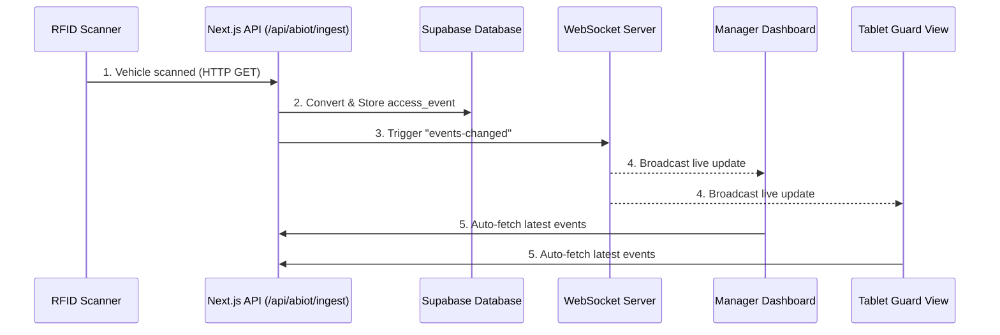
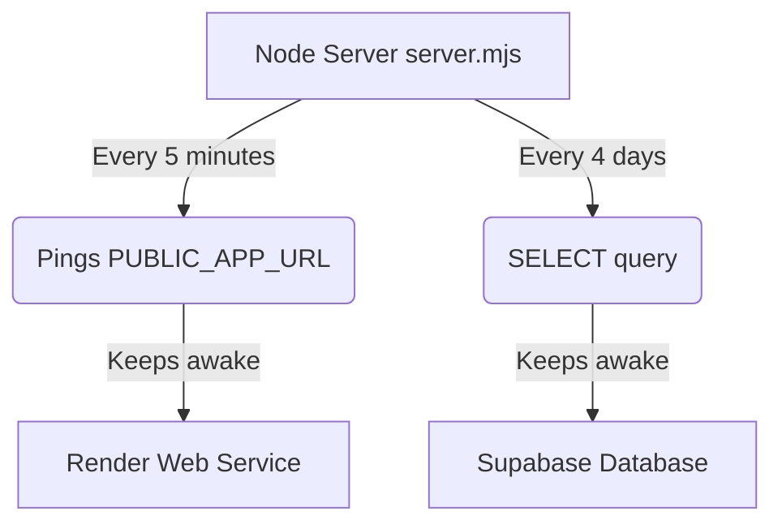

# Seceurope Web

Seceurope Web is a Next.js access-control portal designed for physical gate operations. It provides a real-time manager dashboard, a tablet view for security guards, endpoints to ingest RFID scanner data, and a Supabase-backed event pipeline for vehicle checks.

---

## 🏗️ System Architecture

The following diagram illustrates how RFID scans flow from the physical gate to the dashboards in real-time.



---

## ✨ Features

- **Manager Dashboard (`/manager`):** A real-time control-room interface for monitoring access events, viewing counters (entries vs. exits), and manually resolving security incidents.
- **Tablet Guard View (`/tablet`):** A simplified, guard-facing interface meant for iPads or tablets at the gate to quickly verify if a vehicle is allowed or denied.
- **ABIOT Integration:** Receives standard ABIOT RFID scan data at `/api/abiot/ingest`.
- **Live Updates:** A custom Node.js server (`server.mjs`) pushes updates over WebSockets (`/ws`) to all connected dashboards whenever a new scan is detected.
- **Always-On Scripts:** Built-in background processes prevent free-tier hosting services (Render and Supabase) from going to sleep due to inactivity.

---

## 🚀 Getting Started

### 1. Prerequisites
- [Node.js](https://nodejs.org/) (version 20 or higher)
- npm

### 2. Installation
Install the project dependencies:
```bash
npm install
```

### 3. Environment Configuration
Copy the template to create your local environment file:
```bash
cp .env.example .env.local
```
*Note: See the [Environment Variables](#environment-variables) section below for required values.*

### 4. Running Locally
Start the development server:
```bash
npx cross-env NODE_ENV=development node server.mjs
```

### 5. Production Build
Build and run the application for production:
```bash
npx next build
npx cross-env NODE_ENV=production node server.mjs
```

---

## 📖 How to Use the Portal

1. **Manager Dashboard (`/manager`):** Open this page in your control room. It displays a live feed of all gate activity.
2. **Tablet Guard View (`/tablet`):** Provide this view to physical gate guards. It strips away complex data and highlights simply: "Allow" or "Deny".
3. **RFID Scanners:** Configure your RFID scanners (handhelds or antennas) to send HTTP GET requests to the `/api/abiot/ingest` endpoint whenever a vehicle is scanned.
   - Example payload: `?uhf_epc_hex=...&uhf_tid=...&reader_id=...&mode=handheld&gate_id=...&direction=entry`
4. **Real-time Sync:** As soon as an RFID scanner hits the ingest endpoint, both the Manager and Tablet views will instantly update without requiring a manual page refresh.

---

## 🗄️ Database Setup (Supabase)

This project relies on Supabase for robust data storage. The reference schema is located in [`supabase/schema.sql`](./supabase/schema.sql).

1. Create a new [Supabase](https://supabase.com/) project.
2. Open the SQL Editor in your Supabase dashboard and run the script from `supabase/schema.sql`.
3. Add your Supabase URL and keys to `.env.local`.

*Demo Mode: If Supabase server credentials are missing, the app will fall back to an in-memory database for local testing purposes.*

---

## ⚡ Free Tier Keep-Alive System

If you are hosting this project on free tiers (like Render or Supabase), they typically pause your services after a period of inactivity. This project includes built-in scripts in `server.mjs` to keep them awake.



To enable this, ensure you have set `PUBLIC_APP_URL` in your environment variables.

---

## ⚙️ Environment Variables

Review [`.env.example`](./.env.example) for all available variables.

**Required for Supabase Database:**
- `NEXT_PUBLIC_SUPABASE_URL`
- `NEXT_PUBLIC_SUPABASE_ANON_KEY`
- `SUPABASE_SERVICE_ROLE_KEY`

**Required for Keep-Alive System:**
- `PUBLIC_APP_URL` (e.g. `https://my-seceurope-app.onrender.com`)

**Optional Integrations:**
- `CONVERT_BATCH_SIZE`, `EVENT_FETCH_LIMIT`
- ABIOT endpoints (`ABIOT_API_BASE_URL`, `ABIOT_LOOKUP_URL`, etc.)
- Custom table names (`RAW_SCAN_TABLE`, `ACCESS_EVENTS_TABLE`)

---

## 📡 API Summary

| Endpoint | Method | Description |
|---|---|---|
| `/api/events` | `GET` | Fetches recent access events (supports `?surface=manager` or `tablet`). |
| `/api/abiot/ingest` | `GET` | Main ingestion point for ABIOT RFID scanners. |
| `/api/events/{id}/resolve`| `POST` | Manually resolve or update an event status. |
| `/api/convert/run` | `POST` | Triggers the pending raw scan conversion manually. |
| `/api/abiot/register` | `POST` | Register a new vehicle to ABIOT directly from the portal. |
| `/api/fetch-latest` | `POST` | Forces a manual refresh of the latest events. |

---

## ☁️ Deployment Notes

Because this project uses a custom Node server (`server.mjs`) to support WebSockets, **it cannot be deployed as a standard serverless Next.js app** (e.g., standard Vercel deployments).

You must deploy it to a host that supports long-running Node processes (e.g., **Render**, Railway, DigitalOcean App Platform, AWS EC2).
